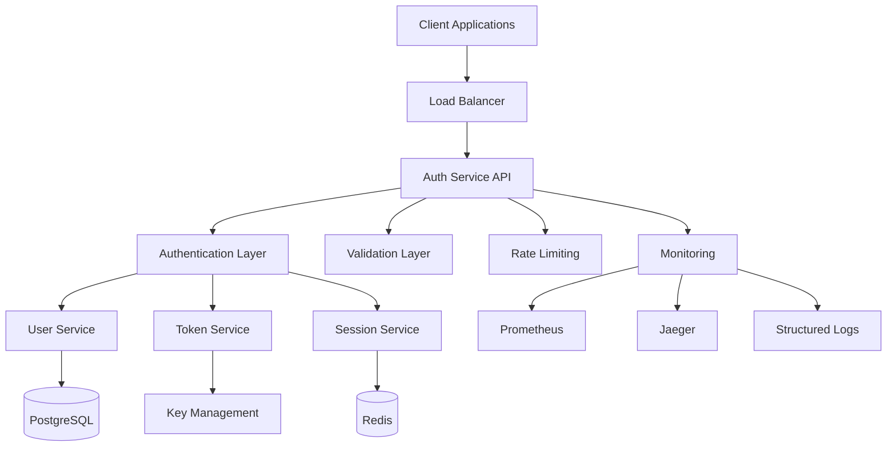

# SmartEdify Auth Service - Design Document

## Overview

The SmartEdify Auth Service is designed as a high-performance, secure microservice that provides authentication and authorization capabilities for the SmartEdify platform. The service follows a layered architecture pattern with clear separation of concerns, implementing industry-standard security practices and supporting multi-tenant operations.

### Key Design Principles

- **Security First**: All operations prioritize security with defense-in-depth approach
- **Multi-tenant Isolation**: Complete data and operational isolation between tenants
- **Stateless Design**: JWT-based authentication with Redis for session management
- **High Performance**: Sub-200ms response times with efficient caching and connection pooling
- **Observability**: Comprehensive logging, metrics, and tracing with correlation IDs
- **Scalability**: Horizontal scaling support with load balancing for 1000+ concurrent users
- **Resilience**: Graceful degradation and circuit breaker patterns for fault tolerance
- **Compliance**: GDPR, FERPA, and SOC 2 compliance with comprehensive audit logging

## Architecture

### High-Level Architecture



### Service Architecture Layers

1. **API Layer**: HTTP endpoints, request routing, middleware
2. **Business Logic Layer**: Core authentication and authorization logic
3. **Data Access Layer**: Database and cache operations
4. **Infrastructure Layer**: External integrations, monitoring, configuration

## Components and Interfaces

### Core Components

#### 1. Authentication Handler
```go
type AuthHandler struct {
    userService    UserService
    tokenService   TokenService
    sessionService SessionService
    validator      RequestValidator
    logger         Logger
}

// Main authentication endpoints
func (h *AuthHandler) Register(c *fiber.Ctx) error
func (h *AuthHandler) Login(c *fiber.Ctx) error
func (h *AuthHandler) Logout(c *fiber.Ctx) error
func (h *AuthHandler) RefreshToken(c *fiber.Ctx) error
func (h *AuthHandler) ValidateToken(c *fiber.Ctx) error
func (h *AuthHandler) ResetPassword(c *fiber.Ctx) error
```

#### 2. User Service
```go
type UserService interface {
    CreateUser(ctx context.Context, req CreateUserRequest) (*User, error)
    GetUserByEmail(ctx context.Context, email, tenantID string) (*User, error)
    GetUserByID(ctx context.Context, userID uuid.UUID) (*User, error)
    UpdateUser(ctx context.Context, userID uuid.UUID, updates UserUpdates) error
    ValidateCredentials(ctx context.Context, email, password, tenantID string) (*User, error)
    UpdateLastLogin(ctx context.Context, userID uuid.UUID, loginInfo LoginInfo) error
    CreatePasswordResetToken(ctx context.Context, email, tenantID string) (string, error)
    ResetPassword(ctx context.Context, token, newPassword string) error
}
```

#### 3. Token Service
```go
type TokenService interface {
    GenerateTokenPair(ctx context.Context, user *User) (*TokenPair, error)
    ValidateAccessToken(ctx context.Context, token string) (*TokenClaims, error)
    ValidateRefreshToken(ctx context.Context, token string) (*TokenClaims, error)
    RefreshTokenPair(ctx context.Context, refreshToken string) (*TokenPair, error)
    RevokeToken(ctx context.Context, token string) error
    RevokeAllUserTokens(ctx context.Context, userID uuid.UUID) error
}
```

#### 4. Session Service
```go
type SessionService interface {
    CreateSession(ctx context.Context, session *Session) error
    GetSession(ctx context.Context, sessionID string) (*Session, error)
    UpdateSession(ctx context.Context, sessionID string, updates SessionUpdates) error
    DeleteSession(ctx context.Context, sessionID string) error
    DeleteAllUserSessions(ctx context.Context, userID uuid.UUID) error
    CleanupExpiredSessions(ctx context.Context) error
}
```

#### 5. Middleware Components
```go
// Rate limiting middleware with Redis backend
func RateLimitMiddleware(config RateLimitConfig, redis RedisClient) fiber.Handler

// Authentication middleware for protected routes
func AuthMiddleware(tokenService TokenService) fiber.Handler

// Tenant validation middleware with caching
func TenantMiddleware(tenantService TenantService) fiber.Handler

// CORS middleware with configurable origins
func CORSMiddleware(config CORSConfig) fiber.Handler

// Security headers middleware (HSTS, CSP, X-Frame-Options, etc.)
func SecurityHeadersMiddleware() fiber.Handler

// Request logging middleware with correlation ID
func LoggingMiddleware(logger Logger) fiber.Handler

// Circuit breaker middleware for external dependencies
func CircuitBreakerMiddleware(config CircuitBreakerConfig) fiber.Handler

// Request timeout middleware
func TimeoutMiddleware(timeout time.Duration) fiber.Handler

// Compression middleware for response optimization
func CompressionMiddleware() fiber.Handler
```

### API Endpoints Design

#### Authentication Endpoints
```
POST /api/v1/auth/register
POST /api/v1/auth/login
POST /api/v1/auth/logout
POST /api/v1/auth/refresh
POST /api/v1/auth/validate
GET  /api/v1/auth/session
POST /api/v1/auth/reset-password
POST /api/v1/auth/reset-password/confirm
```

#### Health and Monitoring
```
GET /health
GET /health/ready
GET /health/live
GET /metrics
```

#### OpenID Connect Endpoints
```
GET /.well-known/openid-configuration
GET /.well-known/jwks.json
POST /oauth/token
GET /oauth/userinfo
```

## Data Models

### User Model
```go
type User struct {
    ID           uuid.UUID  `json:"id" db:"id"`
    Email        string     `json:"email" db:"email"`
    PasswordHash string     `json:"-" db:"password_hash"`
    FirstName    string     `json:"firstName" db:"first_name"`
    LastName     string     `json:"lastName" db:"last_name"`
    TenantID     string     `json:"tenantId" db:"tenant_id"`
    UnitID       string     `json:"unitId" db:"unit_id"`
    Role         string     `json:"role" db:"role"`
    Status       UserStatus `json:"status" db:"status"`
    LastLoginAt  *time.Time `json:"lastLoginAt" db:"last_login_at"`
    LastLoginIP  string     `json:"lastLoginIp" db:"last_login_ip"`
    FailedLogins int        `json:"-" db:"failed_logins"`
    LockedUntil  *time.Time `json:"-" db:"locked_until"`
    CreatedAt    time.Time  `json:"createdAt" db:"created_at"`
    UpdatedAt    time.Time  `json:"updatedAt" db:"updated_at"`
}

type UserStatus string
const (
    UserStatusActive    UserStatus = "active"
    UserStatusInactive  UserStatus = "inactive"
    UserStatusSuspended UserStatus = "suspended"
    UserStatusLocked    UserStatus = "locked"
)
```

### Session Model
```go
type Session struct {
    ID           string    `json:"id" redis:"id"`
    UserID       uuid.UUID `json:"userId" redis:"user_id"`
    TenantID     string    `json:"tenantId" redis:"tenant_id"`
    AccessToken  string    `json:"-" redis:"access_token"`
    RefreshToken string    `json:"-" redis:"refresh_token"`
    ExpiresAt    time.Time `json:"expiresAt" redis:"expires_at"`
    CreatedAt    time.Time `json:"createdAt" redis:"created_at"`
    UpdatedAt    time.Time `json:"updatedAt" redis:"updated_at"`
    IPAddress    string    `json:"ipAddress" redis:"ip_address"`
    UserAgent    string    `json:"userAgent" redis:"user_agent"`
    IsActive     bool      `json:"isActive" redis:"is_active"`
}
```

### Token Models
```go
type TokenPair struct {
    AccessToken  string    `json:"accessToken"`
    RefreshToken string    `json:"refreshToken"`
    ExpiresIn    int       `json:"expiresIn"`
    TokenType    string    `json:"tokenType"`
}

type TokenClaims struct {
    UserID      uuid.UUID `json:"sub"`
    Email       string    `json:"email"`
    TenantID    string    `json:"tenant_id"`
    UnitID      string    `json:"unit_id"`
    Role        string    `json:"role"`
    Permissions []string  `json:"permissions"`
    SessionID   string    `json:"session_id"`
    jwt.RegisteredClaims
}
```

### Request/Response Models
```go
type RegisterRequest struct {
    Email     string `json:"email" validate:"required,email"`
    Password  string `json:"password" validate:"required,min=8"`
    FirstName string `json:"firstName" validate:"required,min=2,max=50"`
    LastName  string `json:"lastName" validate:"required,min=2,max=50"`
    TenantID  string `json:"tenantId" validate:"required"`
    UnitID    string `json:"unitId" validate:"required"`
}

type LoginRequest struct {
    Email    string `json:"email" validate:"required,email"`
    Password string `json:"password" validate:"required"`
    TenantID string `json:"tenantId" validate:"required"`
    UnitID   string `json:"unitId" validate:"required"`
}

type AuthResponse struct {
    User         *User      `json:"user"`
    TokenPair    *TokenPair `json:"tokens"`
    SessionID    string     `json:"sessionId"`
    CorrelationID string    `json:"correlationId"`
}
```

## Error Handling

### Error Response Format
```go
type ErrorResponse struct {
    Error struct {
        Code         string            `json:"code"`
        Message      string            `json:"message"`
        Details      map[string]string `json:"details,omitempty"`
        CorrelationID string           `json:"correlationId"`
        Timestamp    time.Time         `json:"timestamp"`
    } `json:"error"`
}
```

### Error Codes and HTTP Status Mapping
```go
var ErrorCodeMapping = map[string]int{
    "EMAIL_ALREADY_EXISTS":     409,
    "INVALID_EMAIL_FORMAT":     400,
    "WEAK_PASSWORD":           400,
    "MISSING_REQUIRED_FIELDS": 400,
    "INVALID_CREDENTIALS":     401,
    "TOKEN_EXPIRED":           401,
    "TOKEN_INVALID":           401,
    "ACCOUNT_SUSPENDED":       403,
    "INVALID_TENANT_ACCESS":   403,
    "RATE_LIMIT_EXCEEDED":     429,
    "INTERNAL_SERVER_ERROR":   500,
}
```

### Error Handling Strategy
1. **Input Validation Errors**: Return 400 with specific field validation messages
2. **Authentication Errors**: Return 401 with generic messages to prevent enumeration
3. **Authorization Errors**: Return 403 with minimal information
4. **Rate Limiting**: Return 429 with retry-after header and rate limit information
5. **Server Errors**: Return 500 with correlation ID for tracking
6. **Database Errors**: Retry with exponential backoff, fallback to degraded mode
7. **Redis Errors**: Continue operation without sessions, log for monitoring
8. **External Service Timeouts**: Return 503 with retry-after header
9. **Concurrent Modification**: Return 409 with conflict details and retry guidance

### Circuit Breaker Implementation
```go
type CircuitBreaker struct {
    maxFailures   int
    resetTimeout  time.Duration
    state         CircuitState
    failures      int
    lastFailTime  time.Time
}

type CircuitState int
const (
    CircuitClosed CircuitState = iota
    CircuitOpen
    CircuitHalfOpen
)

func (cb *CircuitBreaker) Execute(operation func() error) error {
    // Implement circuit breaker logic
    // Track failures and recovery
    // Provide fallback mechanisms
}
```

### Graceful Degradation
```go
type DegradationMode int
const (
    FullService DegradationMode = iota
    NoSessions  // Redis unavailable, JWT-only validation
    ReadOnly    // Database issues, no writes allowed
    Emergency   // Minimal functionality only
)

func (s *AuthService) GetDegradationMode() DegradationMode {
    // Check health of dependencies
    // Return appropriate degradation level
}
```

## Testing Strategy

### Unit Testing
- **Service Layer Testing**: Mock dependencies, test business logic
- **Handler Testing**: Test HTTP endpoints with mock services
- **Validation Testing**: Test input validation rules
- **Token Testing**: Test JWT generation, validation, and expiration
- **Password Testing**: Test hashing, validation, and security requirements

### Integration Testing
- **Database Integration**: Test PostgreSQL operations with test database
- **Redis Integration**: Test session management with Redis
- **End-to-End API Testing**: Test complete request flows
- **Security Testing**: Test rate limiting, authentication flows
- **Multi-tenant Testing**: Test tenant isolation

### Performance Testing
- **Load Testing**: 1000 concurrent users, sustained load
- **Stress Testing**: Peak load scenarios
- **Token Validation Performance**: Sub-50ms response times
- **Database Performance**: Connection pooling, query optimization
- **Cache Performance**: Redis operations under load

### Security Testing
- **Authentication Testing**: Brute force protection, account lockout
- **Token Security**: JWT tampering, expiration handling
- **Input Validation**: SQL injection, XSS prevention
- **Rate Limiting**: Bypass attempts, distributed attacks
- **Session Security**: Session hijacking, fixation attacks

## Security Implementation

### Password Security
```go
type PasswordPolicy struct {
    MinLength        int
    RequireUppercase bool
    RequireLowercase bool
    RequireNumbers   bool
    RequireSpecial   bool
    MaxAge           time.Duration
    HistoryCount     int
}

func ValidatePassword(password string, policy PasswordPolicy) error
func HashPassword(password string) (string, error)
func VerifyPassword(password, hash string) error
```

### JWT Security
```go
type JWTConfig struct {
    PrivateKey       *rsa.PrivateKey
    PublicKey        *rsa.PublicKey
    AccessTokenTTL   time.Duration
    RefreshTokenTTL  time.Duration
    Issuer           string
    Audience         string
}
```

### Rate Limiting
```go
type RateLimitConfig struct {
    LoginAttempts    RateLimit // 5 per minute per IP
    Registration     RateLimit // 3 per minute per IP
    TokenValidation  RateLimit // 100 per minute per user
    PasswordReset    RateLimit // 3 per hour per email
    GeneralAPI       RateLimit // 1000 per minute per IP
}
```

## Monitoring and Observability

### Metrics Collection
```go
// Prometheus metrics
var (
    RequestDuration = prometheus.NewHistogramVec(...)
    RequestCount    = prometheus.NewCounterVec(...)
    ActiveSessions  = prometheus.NewGaugeVec(...)
    FailedLogins    = prometheus.NewCounterVec(...)
    TokensIssued    = prometheus.NewCounterVec(...)
)
```

### Structured Logging
```go
type LogEntry struct {
    Level         string    `json:"level"`
    Timestamp     time.Time `json:"timestamp"`
    Message       string    `json:"message"`
    CorrelationID string    `json:"correlationId"`
    UserID        string    `json:"userId,omitempty"`
    TenantID      string    `json:"tenantId,omitempty"`
    IPAddress     string    `json:"ipAddress,omitempty"`
    UserAgent     string    `json:"userAgent,omitempty"`
    Duration      int64     `json:"duration,omitempty"`
    Error         string    `json:"error,omitempty"`
}
```

### Health Checks
```go
type HealthChecker interface {
    CheckDatabase(ctx context.Context) error
    CheckRedis(ctx context.Context) error
    CheckKeyStore(ctx context.Context) error
}
```

## Configuration Management

### Configuration Structure
```go
type Config struct {
    Server      ServerConfig      `mapstructure:"server"`
    Database    DatabaseConfig    `mapstructure:"database"`
    Redis       RedisConfig       `mapstructure:"redis"`
    JWT         JWTConfig         `mapstructure:"jwt"`
    Security    SecurityConfig    `mapstructure:"security"`
    Logging     LoggingConfig     `mapstructure:"logging"`
    Metrics     MetricsConfig     `mapstructure:"metrics"`
    RateLimit   RateLimitConfig   `mapstructure:"rateLimit"`
    CORS        CORSConfig        `mapstructure:"cors"`
    OpenID      OpenIDConfig      `mapstructure:"openid"`
}

type ServerConfig struct {
    Port            int           `mapstructure:"port" default:"8080"`
    Host            string        `mapstructure:"host" default:"0.0.0.0"`
    ReadTimeout     time.Duration `mapstructure:"readTimeout" default:"30s"`
    WriteTimeout    time.Duration `mapstructure:"writeTimeout" default:"30s"`
    IdleTimeout     time.Duration `mapstructure:"idleTimeout" default:"120s"`
    ShutdownTimeout time.Duration `mapstructure:"shutdownTimeout" default:"30s"`
}

type DatabaseConfig struct {
    Host            string        `mapstructure:"host" validate:"required"`
    Port            int           `mapstructure:"port" default:"5432"`
    Database        string        `mapstructure:"database" validate:"required"`
    Username        string        `mapstructure:"username" validate:"required"`
    Password        string        `mapstructure:"password" validate:"required"`
    SSLMode         string        `mapstructure:"sslMode" default:"require"`
    MaxOpenConns    int           `mapstructure:"maxOpenConns" default:"25"`
    MaxIdleConns    int           `mapstructure:"maxIdleConns" default:"5"`
    ConnMaxLifetime time.Duration `mapstructure:"connMaxLifetime" default:"5m"`
}

type RedisConfig struct {
    Host         string        `mapstructure:"host" validate:"required"`
    Port         int           `mapstructure:"port" default:"6379"`
    Password     string        `mapstructure:"password"`
    Database     int           `mapstructure:"database" default:"0"`
    PoolSize     int           `mapstructure:"poolSize" default:"10"`
    MinIdleConns int           `mapstructure:"minIdleConns" default:"5"`
    DialTimeout  time.Duration `mapstructure:"dialTimeout" default:"5s"`
    ReadTimeout  time.Duration `mapstructure:"readTimeout" default:"3s"`
    WriteTimeout time.Duration `mapstructure:"writeTimeout" default:"3s"`
}
```

### Configuration Loading and Validation
```go
type ConfigLoader struct {
    validator *validator.Validate
}

func (cl *ConfigLoader) LoadConfig() (*Config, error) {
    // Load from environment variables with validation
    // Support for .env files in development
    // Fail fast on missing required configuration
}

func (cl *ConfigLoader) ValidateConfig(config *Config) error {
    // Validate all required fields
    // Check connectivity to external services
    // Validate JWT key pairs
    // Verify rate limit configurations
}
```

## Deployment Architecture

### Container Configuration
```dockerfile
FROM golang:1.21-alpine AS builder
WORKDIR /app
COPY go.mod go.sum ./
RUN go mod download
COPY . .
RUN CGO_ENABLED=0 GOOS=linux go build -a -installsuffix cgo -o main .

FROM alpine:latest
RUN apk --no-cache add ca-certificates tzdata
WORKDIR /root/
COPY --from=builder /app/main .
COPY --from=builder /app/migrations ./migrations
EXPOSE 8080
CMD ["./main"]
```

### Kubernetes Deployment
```yaml
apiVersion: apps/v1
kind: Deployment
metadata:
  name: smartedify-auth-service
spec:
  replicas: 3
  selector:
    matchLabels:
      app: smartedify-auth-service
  template:
    metadata:
      labels:
        app: smartedify-auth-service
    spec:
      containers:
      - name: auth-service
        image: smartedify/auth-service:latest
        ports:
        - containerPort: 8080
        env:
        - name: DATABASE_HOST
          valueFrom:
            secretKeyRef:
              name: auth-db-secret
              key: host
        resources:
          requests:
            memory: "256Mi"
            cpu: "250m"
          limits:
            memory: "512Mi"
            cpu: "500m"
        livenessProbe:
          httpGet:
            path: /health/live
            port: 8080
          initialDelaySeconds: 30
          periodSeconds: 10
        readinessProbe:
          httpGet:
            path: /health/ready
            port: 8080
          initialDelaySeconds: 5
          periodSeconds: 5
```

## OpenID Connect Implementation

### OpenID Connect Configuration
```go
type OpenIDConfig struct {
    Issuer                string   `json:"issuer"`
    AuthorizationEndpoint string   `json:"authorization_endpoint"`
    TokenEndpoint         string   `json:"token_endpoint"`
    UserInfoEndpoint      string   `json:"userinfo_endpoint"`
    JWKSUri              string   `json:"jwks_uri"`
    ScopesSupported      []string `json:"scopes_supported"`
    ResponseTypesSupported []string `json:"response_types_supported"`
    GrantTypesSupported   []string `json:"grant_types_supported"`
    SubjectTypesSupported []string `json:"subject_types_supported"`
    IdTokenSigningAlgValues []string `json:"id_token_signing_alg_values_supported"`
}
```

### JWKS (JSON Web Key Set) Management
```go
type JWKSManager struct {
    privateKey *rsa.PrivateKey
    publicKey  *rsa.PublicKey
    keyID      string
}

func (j *JWKSManager) GetJWKS() (*jose.JSONWebKeySet, error) {
    // Return public keys for token verification
}

func (j *JWKSManager) RotateKeys() error {
    // Implement key rotation strategy
    // Maintain multiple keys during transition
}
```

### OAuth 2.0 Flows
```go
type OAuthHandler struct {
    tokenService   TokenService
    userService    UserService
    clientService  ClientService
}

// Authorization Code Flow
func (h *OAuthHandler) Authorize(c *fiber.Ctx) error
func (h *OAuthHandler) Token(c *fiber.Ctx) error

// Client Credentials Flow
func (h *OAuthHandler) ClientCredentials(c *fiber.Ctx) error

// Resource Owner Password Credentials (if enabled)
func (h *OAuthHandler) ResourceOwnerPassword(c *fiber.Ctx) error
```

### Scaling Considerations
- **Horizontal Scaling**: Stateless design allows multiple instances
- **Database Connection Pooling**: Efficient resource utilization with 25 max connections
- **Redis Clustering**: Session data distribution across multiple nodes
- **Load Balancing**: Health check endpoints for load balancer integration
- **Circuit Breakers**: Fault tolerance for external dependencies
- **Auto-scaling**: Kubernetes HPA based on CPU/memory metrics
- **Performance Targets**: 
  - 200ms response time for 95% of authentication requests
  - 50ms response time for 99% of token validation requests
  - Support for 1000+ concurrent users
  - 10,000+ requests per minute throughput

### Security Hardening
- **Container Security**: Non-root user, minimal base image, security scanning
- **Network Security**: TLS 1.3, certificate pinning, network policies
- **Secrets Management**: External secret management (Vault, K8s secrets)
- **Audit Logging**: Comprehensive security event logging with SIEM integration
- **Vulnerability Management**: Regular dependency updates, security patches

This design provides a robust, secure, and scalable authentication service that meets all the requirements while following industry best practices for security, performance, and maintainability. The architecture supports high availability, graceful degradation, and comprehensive observability for production environments.