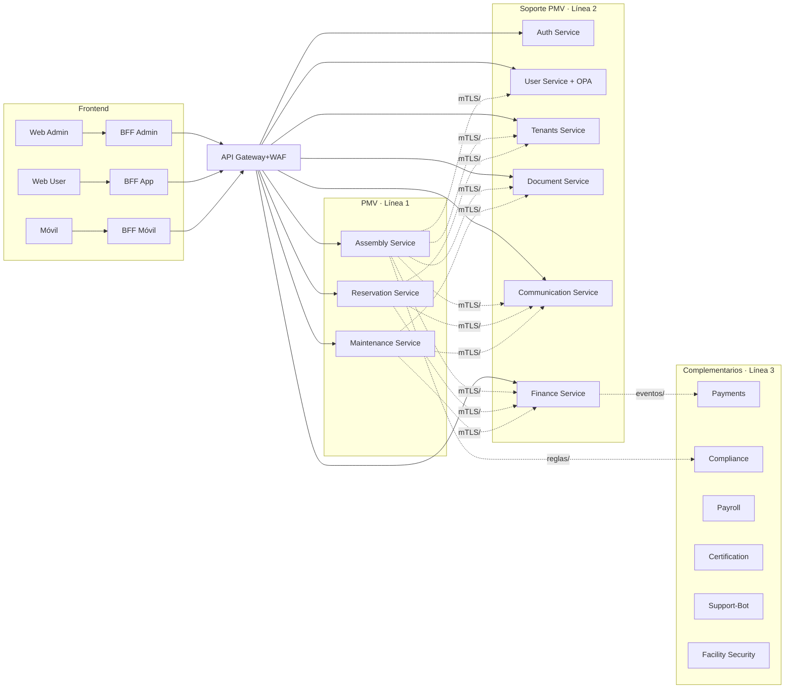

Estructura de monorepo propuesta (SaaS, PMV primero). Incluye `doc/`.

```
smartedify/
├─ apps/
│  ├─ web-admin/                # Next.js (SSR/ISR), UI Admin
│  ├─ web-user/                 # Next.js, UI Usuario
│  ├─ mobile/                   # Expo/React Native
│  └─ bff/
│     ├─ admin/                 # BFF Admin (OIDC PKCE, CSRF, cache corto)
│     ├─ app/                   # BFF Usuario
│     └─ mobile/                # BFF Móvil
├─ services/
│  ├─ pmv/                      # Línea 1 (cercanos al frontend)
│  │  ├─ assembly-service/
│  │  │  ├─ src/
│  │  │  ├─ openapi/            # contratos REST
│  │  │  ├─ db/migrations/
│  │  │  ├─ deployments/        # ecs/k8s manifests
│  │  │  └─ tests/              # unit/contract/e2e
│  │  ├─ reservation-service/
│  │  └─ maintenance-service/
│  ├─ support/                  # Línea 2 (soporte al PMV)
│  │  ├─ auth-service/
│  │  ├─ user-service/          # OPA policies en /policies/
│  │  ├─ tenants-service/
│  │  ├─ document-service/
│  │  ├─ communication-service/
│  │  └─ finance-service/
│  └─ complementary/            # Línea 3 (complementarios)
│     ├─ payments-service/
│     ├─ compliance-service/
│     ├─ payroll-service/
│     ├─ certification-service/
│     ├─ support-bot-service/
│     └─ facility-security-service/
├─ platform/
│  ├─ gateway/                  # rutas, WAF, domains, rate limits
│  ├─ mesh/                     # mTLS, S2S authz, retries, circuit breaking
│  ├─ events/                   # AsyncAPI, esquemas (JSON Schema/Avro), outbox
│  ├─ observability/            # Otel collectors, dashboards, alerts, SLOs
│  ├─ security/                 # OPA bundles, CSP/HSTS, secret policies, KMS
│  └─ shared/                   # libs comunes: tipos, SDK OpenAPI, utils, clients
├─ contracts/
│  ├─ openapi/                  # *.yaml por servicio
│  ├─ asyncapi/                 # eventos por dominio
│  └─ pacts/                    # tests consumidor-productor (BFF↔servicios)
├─ infra/
│  ├─ terraform/
│  │  ├─ modules/               # vpc, rds, redis, s3, cloudfront, waf, ecs, iam
│  │  └─ envs/                  # dev, stg, prod
│  └─ cicd/                     # pipelines, plantillas, imágenes base
├─ config/
│  ├─ dev/ stg/ prod/           # feature flags, env vars plantillas
│  └─ secrets/README.md         # gestión en KMS/Secrets Manager
├─ qa/
│  ├─ k6/                       # pruebas de carga
│  └─ chaos/                    # experimentos de resiliencia
├─ scripts/                     # make, db bootstrap, codegen, lint
├─ .github/workflows/           # CI (lint, tests, contract, build, deploy)
├─ doc/                         # ADRs, arquitectura, runbooks, DPIA, políticas
│  ├─ adr/
│  ├─ diagrams/                 # mermaid, drawio
│  ├─ runbooks/                 # oncall, incident, DR
│  ├─ security/                 # modelo de amenazas, controles Ley 29733
│  └─ product/                  # roadmaps, criterios PMV
└─ README.md
```

Convenciones clave:

* Un servicio = su propio Postgres, `openapi/`, `db/migrations/`, `deployments/`, `tests/`.
* Eventos versionados en `platform/events/`; contratos sincronizados con CI.
* BFF termina PKCE y oculta refresh. UIs consumen solo BFF.
* `platform/mesh` gobierna tráfico este-oeste; Gateway solo norte-sur.
* `doc/adr` registra decisiones; cambios breaking requieren ADR y versión de contrato.

### 2.3 Reglas operativas y Diagrama de Flujo

## Reglas operativas

Clientes (UI Web Admin, Web User, Móvil) → BFF por canal → API Gateway → servicios PMV.

Servicio→Servicio: solo por malla, nunca por Gateway. Autorización con OAuth2 m2m (client credentials) o JWT exchange corto.

Identidad multi-tenant: tenant_id en JWT del usuario; cada servicio revalida políticas con User/OPA y aplica RLS.

Egresos externos: SMS/Email/Payments solo vía Egress Gateway con allowlist y DLP.

Eventos primero: comandos sincrónicos mínimos; todo lo demás, eventos con idempotencia.

### Diagrama (flujo recomendado)


