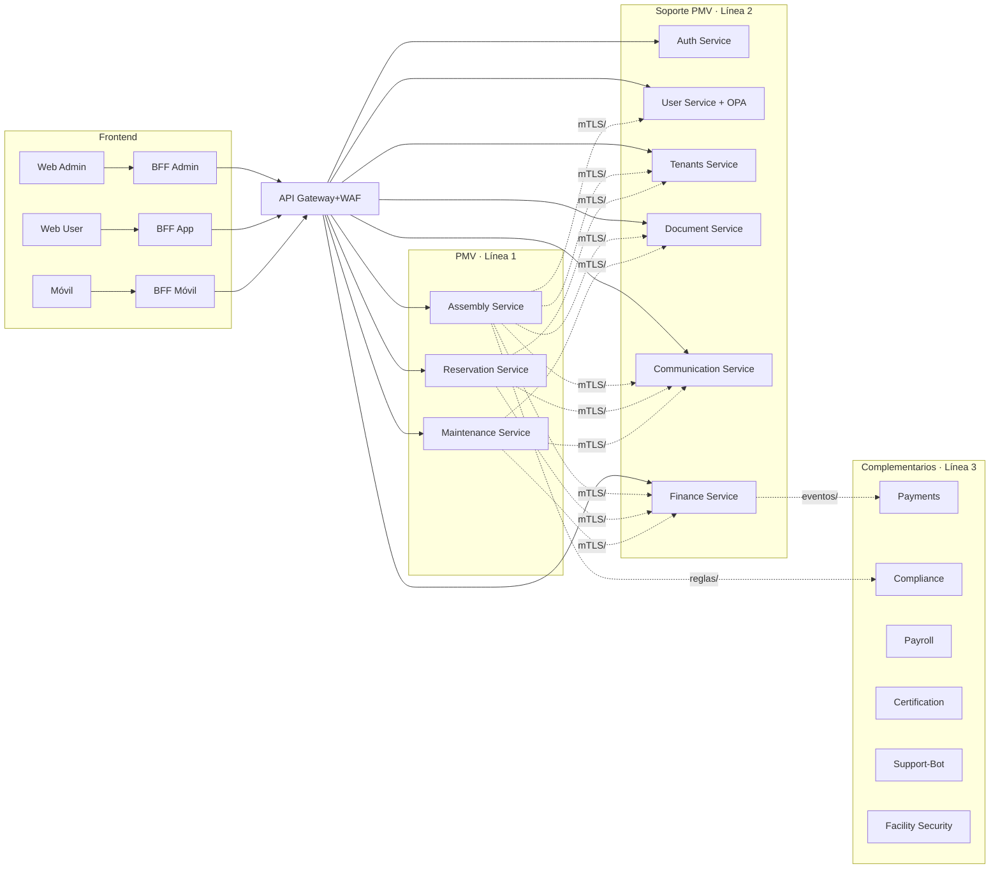
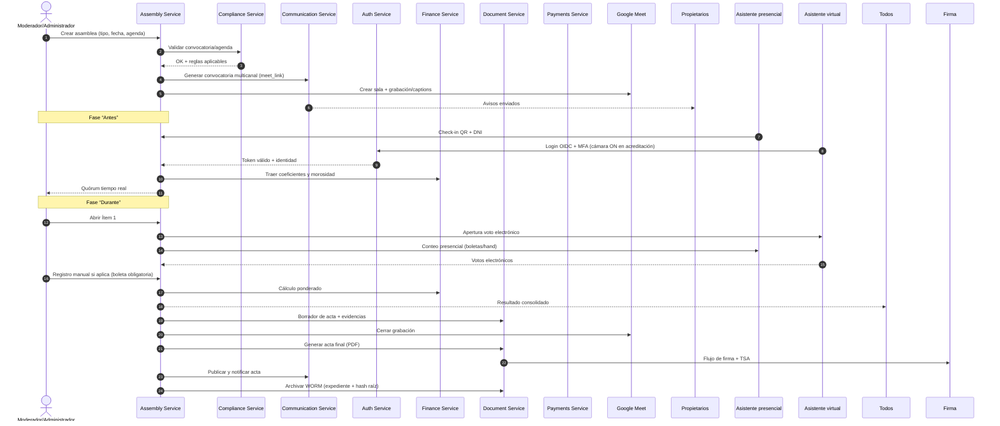
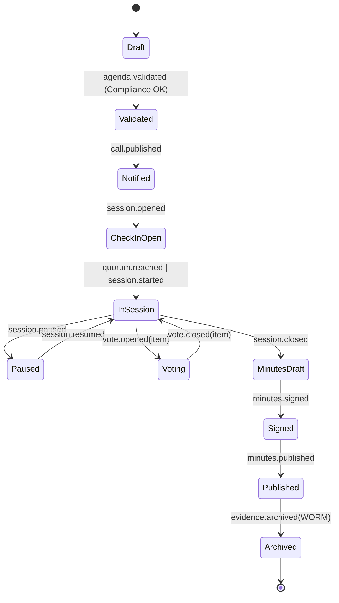
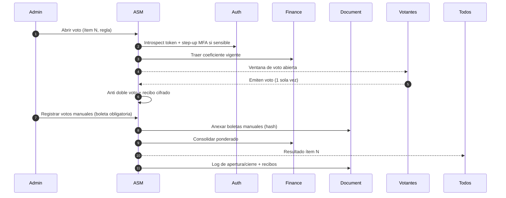

Estructura de monorepo propuesta (SaaS, PMV primero). Incluye `doc/`.

```
smartedify/
├─ apps/
│  ├─ web-admin/                # Next.js (SSR/ISR), UI Admin
│  ├─ web-user/                 # Next.js, UI Usuario
│  ├─ mobile/                   # Expo/React Native
│  └─ bff/
│     ├─ admin/                 # BFF Admin (OIDC PKCE, CSRF, cache corto)
│     ├─ app/                   # BFF Usuario
│     └─ mobile/                # BFF Móvil
├─ services/
│  ├─ pmv/                      # Línea 1 (cercanos al frontend)
│  │  ├─ assembly-service/
│  │  │  ├─ src/
│  │  │  ├─ openapi/            # contratos REST
│  │  │  ├─ db/migrations/
│  │  │  ├─ deployments/        # ecs/k8s manifests
│  │  │  └─ tests/              # unit/contract/e2e
│  │  ├─ reservation-service/
│  │  └─ maintenance-service/
│  ├─ support/                  # Línea 2 (soporte al PMV)
│  │  ├─ auth-service/
│  │  ├─ user-service/          # OPA policies en /policies/
│  │  ├─ tenants-service/
│  │  ├─ document-service/
│  │  ├─ communication-service/
│  │  └─ finance-service/
│  └─ complementary/            # Línea 3 (complementarios)
│     ├─ payments-service/
│     ├─ compliance-service/
│     ├─ payroll-service/
│     ├─ certification-service/
│     ├─ support-bot-service/
│     └─ facility-security-service/
├─ platform/
│  ├─ gateway/                  # rutas, WAF, domains, rate limits
│  ├─ mesh/                     # mTLS, S2S authz, retries, circuit breaking
│  ├─ events/                   # AsyncAPI, esquemas (JSON Schema/Avro), outbox
│  ├─ observability/            # Otel collectors, dashboards, alerts, SLOs
│  ├─ security/                 # OPA bundles, CSP/HSTS, secret policies, KMS
│  └─ shared/                   # libs comunes: tipos, SDK OpenAPI, utils, clients
├─ contracts/
│  ├─ openapi/                  # *.yaml por servicio
│  ├─ asyncapi/                 # eventos por dominio
│  └─ pacts/                    # tests consumidor-productor (BFF↔servicios)
├─ infra/
│  ├─ terraform/
│  │  ├─ modules/               # vpc, rds, redis, s3, cloudfront, waf, ecs, iam
│  │  └─ envs/                  # dev, stg, prod
│  └─ cicd/                     # pipelines, plantillas, imágenes base
├─ config/
│  ├─ dev/ stg/ prod/           # feature flags, env vars plantillas
│  └─ secrets/README.md         # gestión en KMS/Secrets Manager
├─ qa/
│  ├─ k6/                       # pruebas de carga
│  └─ chaos/                    # experimentos de resiliencia
├─ scripts/                     # make, db bootstrap, codegen, lint
├─ .github/workflows/           # CI (lint, tests, contract, build, deploy)
├─ doc/                         # ADRs, arquitectura, runbooks, DPIA, políticas
│  ├─ adr/
│  ├─ diagrams/                 # mermaid, drawio
│  ├─ runbooks/                 # oncall, incident, DR
│  ├─ security/                 # modelo de amenazas, controles Ley 29733
│  └─ product/                  # roadmaps, criterios PMV
└─ README.md
```

Convenciones clave:

* Un servicio = su propio Postgres, `openapi/`, `db/migrations/`, `deployments/`, `tests/`.
* Eventos versionados en `platform/events/`; contratos sincronizados con CI.
* BFF termina PKCE y oculta refresh. UIs consumen solo BFF.
* `platform/mesh` gobierna tráfico este-oeste; Gateway solo norte-sur.
* `doc/adr` registra decisiones; cambios breaking requieren ADR y versión de contrato.

### 2.3 Reglas operativas y Diagrama de Flujo

## Reglas operativas

Clientes (UI Web Admin, Web User, Móvil) → BFF por canal → API Gateway → servicios PMV.

Servicio→Servicio: solo por malla, nunca por Gateway. Autorización con OAuth2 m2m (client credentials) o JWT exchange corto.

Identidad multi-tenant: tenant_id en JWT del usuario; cada servicio revalida políticas con User/OPA y aplica RLS.

Egresos externos: SMS/Email/Payments solo vía Egress Gateway con allowlist y DLP.

Eventos primero: comandos sincrónicos mínimos; todo lo demás, eventos con idempotencia.

### Diagrama acordado



Aquí tienes los flujos, nivel BA. Primero orquestación SmartEdify. Luego cada microservicio. Assembly Service al detalle.

# Orquestación SmartEdify (end-to-end)



# Assembly Service — detalle por flujo

## 0) Ciclo de vida y estados



## 1) Creación y validación de asamblea

* Input: tipo, jurisdicción, fecha, agenda preliminar, reglas del reglamento.
* Pasos:

  1. `POST /assemblies` → estado `Draft`.
  2. `POST /assemblies/{id}/agenda/validate` → Compliance valida plazos, mayorías, quórum por ítem.
  3. `POST /assemblies/{id}/meet` → crea sala Meet, activa captions y esquema de grabación.
  4. `POST /assemblies/{id}/call/publish` → Communication envía convocatoria; Document guarda PDF con hash.
* Salidas: `agenda.validated`, `call.published`, `meet.created`.

## 2) Acreditación y check-in

* Presencial: escaneo QR, verificación DNI, device binding opcional.
* Virtual: OIDC + MFA; **cámara ON** durante acreditación.
* Poderes: carga y validación de tope.
* Datos guardados: `attendee.source`, coeficiente, canal, evidencias.
* Eventos: `attendee.checked_in`, `proxy.registered`.
* Reglas: deduplicación por persona; bloqueo si morosidad afecta voto.

## 3) Cómputo de quórum en vivo

* Motor consolida: presencial + virtual + representados.
* UI: tablero público espejo para sala y para Meet.
* KPI: p95 < 1 s para refresco.
* Evento: `quorum.updated`. Umbrales por ítem disponibles.

## 4) Moderación y órdenes del día

* Abrir/cerrar ítems secuenciales.
* Turnos de palabra: cola unificada.
* Incidencias: moción, objeción, pausa con sello de tiempo.
* Eventos: `item.opened`, `incident.logged`, `item.closed`.

## 5) Votación electrónica unificada



* Modos: nominal, secreto, coeficiente, delegados, bloque.
* Manual: solo moderador. Campo `source=manual`, `ballot_url` obligatorio.
* Seguridad: one-time vote token, replay guard, nonces, hashing de recibo.
* Evento: `vote.closed`, `vote.results_published`.

## 6) Redacción de acta en vivo

* Borrador incremental: resúmenes MPC + marcadores a clips.
* Sección fija “Registros manuales”.
* Evidencias: convocatoria, asistentes, poderes, logs voto, grabación, hashes.
* Salida: `draft.updated` → PDF provisional en Document.

## 7) Firma, publicación y archivo

* Firma digital cualificada + TSA.
* `minutes.signed` → `minutes.published` → notificación multicanal.
* Archivo WORM: expediente + **hash raíz** de manifiesto.
* Eventos: `minutes.signed`, `minutes.published`, `evidence.archived`.

## 8) Post: acuerdos, seguimiento, impugnaciones

* Plan de tareas por acuerdo (responsable, fecha).
* Ventana de impugnación según Compliance.
* Recordatorios y reporte de cumplimiento.

---

# Workflows por microservicio

## Auth Service

* **Login**: `/oidc/authorize` → MFA (TOTP/WebAuthn) → token con `tenant_id` y scopes.
* **Step-up**: solicitar MFA para abrir votos sensibles.
* **Introspect/Revocar**: tokens rotados; eventos de seguridad auditados.

## Compliance Service

* **Validación**: entrada agenda + jurisdicción → reglas aplicables → dictamen.
* **Alertas**: cambios normativos → `compliance.rule.updated`.
* **Cálculo**: mayorías por ítem, plazos, requisitos de convocatoria y firma.

## Finance Service

* **Coeficientes**: padrón, alícuotas, morosidad.
* **Cobranzas**: conciliación si hay pagos de convocatoria o multas de asamblea.
* **Estados**: exposición de coeficiente vigente por persona.

## Payments Service

* **Intents**: cobro de derechos o servicios ligados a la asamblea.
* **Webhooks**: `payment_succeeded` → Finance concilia.

## Communication Service

* **Convocatoria**: plantillas, multicanal, acuse y rebote.
* **Sesión**: recordatorios, cambio de sala, emergencias.
* **Publicación**: distribución de acta y acuerdos.

## Document Service

* **Almacenamiento**: S3, versiones, OCR.
* **Firma**: flujo con TSA, evidencia LTV.
* **WORM**: expediente con índice y hashes; compendio de boletas.

## SupportBot Service

* **Onboarding**: guía paso a paso para asistentes.
* **FAQ**: micropolíticas de voto, quórum, soporte técnico.
* **Escalamiento**: integra con Communication si hay incidentes.

## FacilitySecurity Service

* **Perímetro**: monitoreo de cámaras durante eventos grandes.
* **Accesos**: registro de apertura/cierre si se usa control facial.
* **Privacidad**: solo eventos y metadatos al acta si procede.

## Reservation Service

* **Espacios**: bloqueo y logística del salón.
* **Calendario**: evitar choques con otras reservas.
* **Costos**: traspaso a Finance si aplica.

## Maintenance Service

* **Soporte**: equipos A/V, micrófonos, UPS, conectividad.
* **OTs**: instalación, prueba, contingencia.
* **Post**: correctivos si falló equipamiento.

## Payroll Service

* **Roles**: validación de moderador/secretario si son staff.
* **Trazabilidad**: asistencia de personal en evento.
* **Documentos**: export regulatorios si aplica.

## Certification Service

* **Cumplimientos**: seguridad del local, aforo, rutas de evacuación.
* **Inspecciones**: registros y hallazgos anexables al expediente.

---

# Entregables operativos rápidos

* Diagramas incluidos.
* Estados y eventos cerrados.
* Campos críticos definidos para legalidad: `source=manual`, hashes, TSA, cámara ON en acreditación, quórum público.

