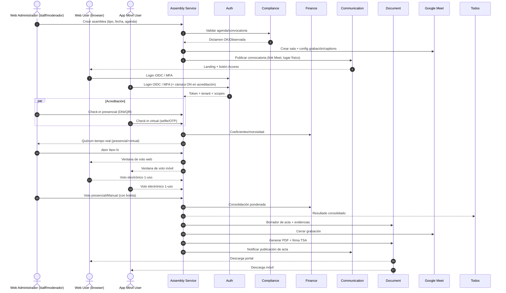

Desarrollo BA. Orquestación end-to-end y flujos por microservicio, con foco en **Assembly Service**. Frontends normalizados: **Web Administrador (WA)**, **Web User (WU)**, **App Móvil User (MU)**.

# Orquestación SmartEdify (E2E)

# Assembly Service — flujos detallados

## 1) Antes: creación, validación y convocatoria

**Objetivo:** sesión mixta legal y trazable.
**Entradas:** tipo, jurisdicción, agenda preliminar, padrón, calendario.
**Pasos BA:**

1. WA crea asamblea → `Draft`.
2. ASM consulta CMP: reglas por jurisdicción, mayorías, plazos.
3. ASM valida agenda; bloquea ítems observados; recalcula quórum esperado.
4. ASM crea sala Meet y activa grabación/captions.
5. ASM genera convocatoria: lugar físico + link Meet + instrucciones + soporte técnico.
6. COM envía multicanal; DOC guarda PDF sellado; ASM cambia a `Notified`.
   **Salidas:** `agenda.validated`, `call.published`, `meet.created`.
   **Excepciones:** reglas fallidas → corrección y revalidación.

## 2) Acreditación y quórum en vivo

**Objetivo:** identidad fehaciente y cómputo consolidado.
**Entradas:** padrón, coeficientes, poderes.
**Pasos:**

1. Presencial: WA registra check-in (DNI/QR).
2. Virtual: WU/MU login OIDC + MFA; MU cámara ON; selfie opcional.
3. ASM asocia poder y coeficiente vigente (FIN).
4. ASM emite tablero de quórum público (SSE) para sala y Meet.
   **Reglas:** dedupe persona+sesión; bloqueo si morosidad restringe voto; trazabilidad canal.
   **Salidas:** `attendee.checked_in`, `quorum.updated`.

## 3) Moderación y votación unificada

**Objetivo:** voto único por propietario y consolidación transparente.
**Pasos:**

1. WA abre Ítem N; ASM hace step-up MFA si sensible.
2. ASM abre ventana de voto a WU/MU; entrega token 1-uso (JTI).
3. WU/MU emiten voto; ASM valida anti-replay y genera recibo cifrado.
4. Presencial: conteo visible; si manual, WA sube boleta → DOC.
5. ASM consolida con FIN (ponderado) y publica resultado en vivo.
6. Cierra ventana; guarda logs de apertura/cierre y hashes.
   **Salidas:** `vote.closed`, `vote.results_published`.
   **Excepciones:** empate o falta de quórum → procedimiento según CMP.

## 4) Acta, firma, publicación y archivo

**Objetivo:** documento legal, firmado y verificable.
**Pasos:**

1. ASM arma borrador con MPC, clips referenciados, “Registros manuales”.
2. DOC genera PDF, aplica TSA, LTV y manifiesto de evidencias.
3. WA firma digital; ASM marca `Signed` → `Published`.
4. COM distribuye; DOC archiva WORM con hash raíz.
   **Salidas:** `minutes.signed`, `minutes.published`, `evidence.archived`.
   **Excepciones:** fallo de firma → reintento; conflicto de versión → bloqueo optimista.

---

# Flujos por cliente

**Web Administrador (WA)**

* Crear/editar asamblea, agenda, convocatoria.
* Acreditación presencial y poderes.
* Moderación, apertura/cierre ítems, registros manuales con boleta obligatoria.
* Validación visual de quórum y resultados.
* Emisión y firma del acta, publicación.

**Web User (WU)**

* Landing pública → Login.
* Ver convocatoria y agenda.
* Asistir virtual por navegador y votar.
* Ver resultados y descargar acta.

**App Móvil User (MU)**

* Login + MFA + check-in con cámara.
* Quórum y agenda en vivo.
* Voto 1-uso con recibo.
* Notificaciones y descarga de acta.

---

# Workflows por microservicio

## Auth Service

* **Login/OIDC:** authorize → token → refresh rotation.
* **MFA step-up:** requerido al abrir voto sensible y firmar acta.
* **Introspect/JWKS:** ASM valida token y scopes.
* **Salidas:** `auth.session.created`, `auth.mfa.verified`.

## Compliance Service

* **Validar agenda/convocatoria:** leyes aplicables, mayorías, plazos.
* **Emitir dictamen:** `approved|observed` con referencias.
* **Alertas:** cambios normativos impactan reglas.
* **Salidas:** `compliance.validation.passed|failed`, `compliance.rule.updated`.

## Finance Service

* **Coeficientes y morosidad:** snapshot por asamblea.
* **Cálculo ponderado:** consolidación de votos.
* **Salidas:** `finance.coefficient.snapshotted`, `finance.vote.weighted`.

## Communication Service

* **Convocatorias y recordatorios:** plantillas dinámicas, tracking.
* **Publicación de acta:** multicanal con acuses.
* **Salidas:** `comm.message.sent`, `comm.delivery.confirmed`.

## Document Service

* **Convocatoria/Acta/Boletas:** almacenamiento, versiones, OCR.
* **Firma digital + TSA:** evidencia LTV.
* **WORM:** expediente, hash raíz del manifiesto.
* **Salidas:** `document.stored`, `document.signed`, `document.retained`.

## Payments Service

* **Opcional:** cobros asociados a asamblea.
* **Salidas:** `payments.intent.succeeded` → FIN concilia.

## SupportBot Service

* **Onboarding/FAQ:** flujo guiado antes y durante sesión.
* **Escalamiento:** crea incidencia a WA si hay problemas.

## FacilitySecurity Service

* **Opcional:** monitoreo y control de accesos del local.
* **Eventos:** `facsec.incident.detected` si aplica.

## Reservation/Maintenance/Payroll/Certification

* **Preparación del local y soporte A/V**, reservas, OTs, certificaciones del recinto, staff si aplica.

---

# Artefactos, entradas y salidas clave

| Artefacto                   | Creador  | Guarda | Verifica  |
| --------------------------- | -------- | ------ | --------- |
| Convocatoria PDF + hash     | ASM      | DOC    | CMP       |
| Registro de asistencia      | WA/MU/WU | ASM    | AUDIT     |
| Boletas manuales            | WA       | DOC    | ASM       |
| Logs de voto y recibos      | ASM      | DOC    | AUDIT     |
| Acta firmada + TSA          | ASM/DOC  | DOC    | CMP       |
| Expediente WORM + hash raíz | ASM/DOC  | DOC    | Auditoría |

---

# Éxito y KPIs

* % de convocatorias aprobadas sin observaciones.
* p95 latencia open/close voto < 200 ms.
* 0 doble voto detectado.
* Tiempo emisión de acta firmada < 24 h.
* % entregas de notificación de acta > 98%.

