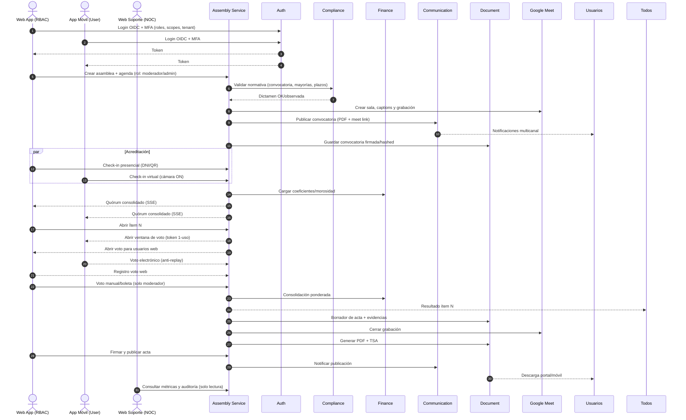

Flujos BA actualizados. Un solo **Web App (RBAC)** para todos los roles; **Web Soporte** solo NOC; **App Móvil** solo user.

# Orquestación SmartEdify (E2E)

# Assembly Service — detalle por fase

## Antes

**Entradas:** tipo, jurisdicción, agenda, plazos, padrón.
**Pasos:**

1. Crear asamblea → estado `Draft`.
2. Validar agenda/convocatoria con Compliance → `Validated`.
3. Crear sala Meet y configuración de grabación/captions.
4. Generar convocatoria PDF con instrucciones mixtas; sellar y guardar.
5. Publicar convocatoria por Communication → `Notified`.
   **Reglas:** solo ítems validados; plazos mínimos; hash y sello de tiempo obligatorios.
   **Salidas:** `agenda.validated`, `call.published`, `meet.created`.

## Durante

**Acreditación y quórum**

* Presencial: DNI/QR en Web App.
* Virtual: login + MFA + cámara ON en check-in (Móvil/Web).
* Asociar poderes y coeficientes (Finance).
* Tablero público de quórum por SSE para web y móvil.
  **Eventos:** `attendee.checked_in`, `quorum.updated`.

**Moderación y votación**

* Abrir ítem, step-up MFA si sensible.
* Emitir tokens 1-uso por votante/ítem (JTI).
* Anti-doble voto; recibo cifrado por voto.
* Votos manuales requieren boleta escaneada y motivo.
* Consolidar con Finance y publicar resultado en vivo.
  **Eventos:** `vote.opened`, `manual.vote.recorded`, `vote.closed`, `vote.results_published`.

**Incidencias**

* Pausa/reanudación con sellos; mociones y objeciones auditadas.
  **Eventos:** `session.paused|resumed`, `incident.logged`.

## Después

**Acta y archivo**

* Borrador automático con MPC + clips referenciados.
* Sección “Registros manuales” con hashes y anexos.
* Firma digital + TSA; publicación y notificación.
* Archivo WORM del expediente con hash raíz.
  **Eventos:** `minutes.signed`, `minutes.published`, `evidence.archived`.

---

# Flujos por interfaz

## Web App (RBAC)

* **Moderador/Admin:** crear/validar asamblea, acreditación presencial, abrir/cerrar ítems, registrar manuales, firmar/publicar acta, ver auditoría.
* **Propietario vía Web:** ver agenda, check-in virtual, votar, ver resultados, descargar acta.
* **Secretario:** redactar observaciones, co-firmar acta.
* **Soporte\_local:** monitoreo de sala, asistencia técnica, sin permisos de voto/manual.

## App Móvil (User)

* Login + MFA.
* Check-in con cámara, agenda/quórum en vivo.
* Voto 1-uso con recibo.
* Notificaciones y descarga de acta.

## Web Soporte (NOC)

* Métricas, trazas, auditoría, salud de servicios.
* Solo lectura. Sin operación de asambleas.

---

# Workflows por microservicio

## Auth Service

* **Login/Refresh/Step-up** para voto y firma.
* **Emisión de claims**: `tenant_id`, `roles`, `scopes`.
* **Auditoría** de sesiones y MFA.

## Compliance Service

* **Validación** de convocatoria/agenda/quórum y mayorías por jurisdicción.
* **Dictamen** con referencias legales y plazos.
* **Alertas** por cambios normativos.

## Finance Service

* **Coeficientes** y estado de morosidad.
* **Cálculo ponderado** por ítem y consolidación de resultados.
* **Snapshots** por asamblea.

## Communication Service

* **Convocatorias** con pruebas de envío y rebotes.
* **Recordatorios** y **publicación de acta** con acuses.

## Document Service

* **Convocatoria/Acta/Boletas**: almacenamiento, versiones, OCR.
* **Firma digital + TSA** y **WORM** del expediente.
* **Manifiesto** con hash raíz.

## Payments Service (opcional)

* Cobros asociados a asambleas si aplica; retorno a Finance.

## SupportBot Service

* Onboarding y FAQs guiadas; escalamiento a soporte.

## FacilitySecurity/Reservation/Maintenance/Payroll/Certification

* Soporte de recinto, reservas del salón, A/V, personal y cumplimiento del local cuando corresponda.

---

# Reglas y controles transversales

* **RBAC + ABAC** en APIs de Assembly: acción por rol y por ítem.
* **Cámara ON** en check-in virtual.
* **Anti-doble voto**: token JTI + índice único `(item_id, voter_id)` para `auto`.
* **Manual = boleta obligatoria**; sin anexo es inválido.
* **Quórum y resultados públicos** en tiempo real.
* **Trazabilidad**: sellos, hashes, TSA, manifiesto WORM.

# Entradas/Salidas por fase (mínimas)

* **Antes:** entrada agenda+padrón → salida convocatoria validada + meet\_link.
* **Durante:** entrada asistencias+votos → salida resultados consolidados + recibos.
* **Después:** entrada borrador+evidencias → salida acta firmada publicada + expediente WORM.

¿Necesitas esto convertido a **BPMN 2.0** o al **contrato OpenAPI** de Assembly para implementación inmediata?
