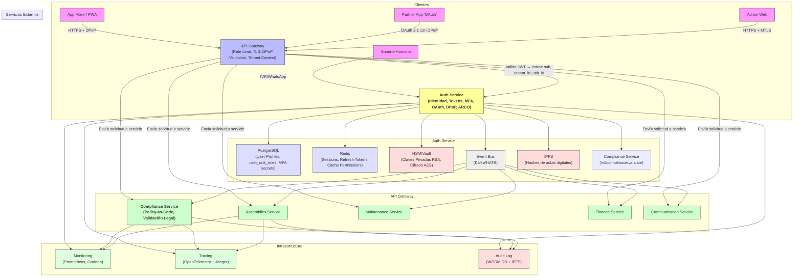
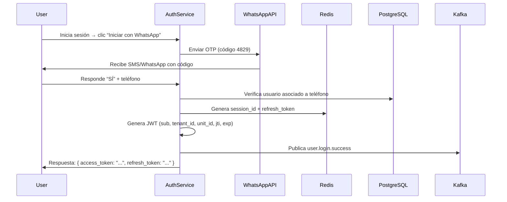
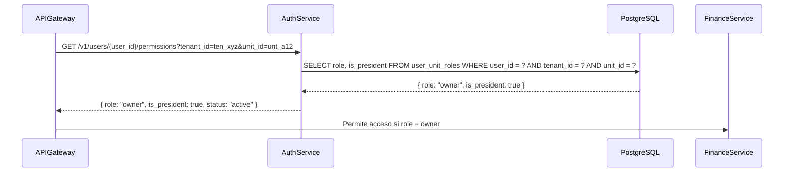
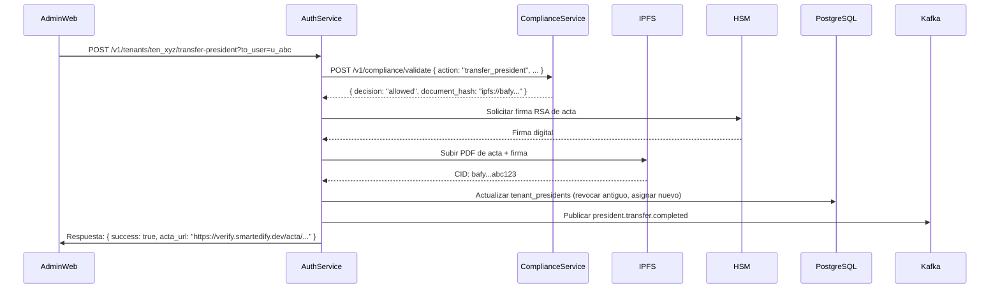

# ✅ **SMARTEDIFY v.0 – DOCUMENTO DE DISEÑO Y ARQUITECTURA**  
## **Auth Service — Infraestructura de Identidad Digital para Comunidades Legales en LatAm**

> **Versión**: v.1.0 (Definitiva)  
> **Fecha**: Abril 2025  
> **Autor**: Software Architect, SmartEdify  
> **Aprobado por**: CPO, Head of Security, Legal Counsel, Engineering Lead  

---

## ✅ **1. Especificaciones de Diseño**

> *“Qué se debe construir, cómo y bajo qué restricciones técnicas.”*

### 1.1 Propósito del Servicio
El **Auth Service** es el microservicio central encargado de:
- **Autenticar** identidades de usuarios (propietarios, inquilinos, administradores).
- **Autorizar** accesos mediante tokens seguros y políticas dinámicas.
- **Gestionar** credenciales, sesiones, MFA y flujos OAuth 2.1/OIDC.
- **Validar** legalmente el rol de presidente y propietario mediante integración con Compliance Service.
- **Garantizar** cumplimiento con Ley N° 27157 (Perú), LPDP (Ley 29733) y estándares internacionales (NIST, OWASP).

> 🔑 **Principio rector**:  
> *“Ningún otro servicio confía en un token hasta que Auth Service lo valide. Ningún usuario puede ser más que lo que la ley le permite.”*

### 1.2 Requisitos de Diseño Funcionales

| ID | Requisito | Descripción Técnica |
|----|----------|---------------------|
| FD-01 | Registro de usuario | `POST /v1/auth/register` acepta `email`, `phone`, `name`, `tenant_id`, `terms_accepted`. Valida formato de correo, longitud mínima de contraseña (12 chars), unicidad de email por tenant. Devuelve `user_id`, `tenant_id`, `status: "pending_verification"`. Emite evento `user.created`. |
| FD-02 | Login por WhatsApp | Flujo principal. Usuario recibe OTP por WhatsApp → responde “SÍ” → sistema genera JWT. No requiere contraseña. Validación de número mediante conexión a Twilio/Mercado Pago. |
| FD-03 | Login por FIDO2/WebAuthn | Soporta huella, Face ID, llaves físicas. Genera credenciales criptográficas vinculadas a `user_id` y `tenant_id`. Almacena solo `credential_id` y `public_key` en PostgreSQL. Clave privada nunca sale del dispositivo. |
| FD-04 | Token JWT sin roles | Tokens emitidos contienen: `sub`, `tenant_id`, `unit_id`, `iat`, `exp`, `jti`. **NUNCA incluyen `roles`, `scopes` o `permissions`**. La autorización se valida en tiempo real. |
| FD-05 | Refresh Token en Redis | Tokens refresh almacenados en Redis con TTL configurable (máx. 7 días). Revocables por `jti` mediante `/revoke`. |
| FD-06 | Rotación automática de claves | Clave privada RSA-256 almacenada en HSM/Vault. JWKS expuesto en `/.well-known/jwks.json`. Rotación cada 90 días. Claves antiguas vigentes 7 días. |
| FD-07 | DPoP Obligatorio | Todos los clientes externos deben incluir encabezado `DPoP` en solicitudes. Token solo válido si se presenta junto con prueba de posesión de clave privada. |
| FD-08 | MTLS Interno | Comunicación entre Auth Service y Compliance, Assemblies, Finance requiere certificados mutuos (mTLS). Certificados gestionados por Vault. |
| FD-09 | ARCO completo | Endpoints: `GET /v1/auth/arco/access`, `PUT /v1/auth/arco/rectify`, `DELETE /v1/auth/arco/delete`. Requieren MFA y verificación de identidad. Registra acción en bitácora inmutable. |
| FD-10 | Actas digitales firmadas | Al generar actas (elección, transferencia, reconocimiento), Auth Service llama a Compliance Service → obtiene PDF firmado con RSA desde HSM → hash almacenado en IPFS → devuelve URL de verificación. |
| FD-11 | Eventos de identidad | Publica eventos en Kafka/NATS: `user.created`, `user.updated`, `role.changed`, `president.transfer.completed`, `token.revoked`, `compliance.decision`. |
| FD-12 | SDKs y DX | Repositorios públicos: `@smartedify/auth-sdk-nodejs`, `@smartedify/auth-sdk-python`. Documentación auto-generada. Sandbox público disponible. |

### 1.3 Requisitos de Diseño No Funcionales

| Tipo | Requisito | Detalle |
|------|----------|---------|
| **Seguridad** | Confidencialidad | Datos sensibles (secretos TOTP, tokens revocados) cifrados con AES-256-GCM. Clave de cifrado rotada trimestralmente. |
| | Integridad | Bitácora inmutable con cadena de hashes. Firmas digitales en actas. |
| | Disponibilidad | 99.95% uptime. Multi-zona AWS (us-east-1 + sa-east-1). |
| | No repudio | Todas las acciones registradas con IP, device fingerprint, timestamp y firma digital. |
| **Rendimiento** | Latencia | Login ≤ 800ms. JWKS ≤ 100ms. Autorización (en tiempo real) ≤ 120ms. |
| | Escalabilidad | Soporta 10K RPS por instancia. Auto-scaling basado en CPU y métricas de Redis. |
| **Usabilidad** | Accesibilidad | Compatible con lectores de pantalla. Contraste WCAG AAA. Texto mínimo 18px. |
| | Simplicidad | Nada de contraseñas en flujo principal. Solo WhatsApp, FIDO2 o OTP. |
| **Cumplimiento** | Legal | Cumple Ley 27157 (Perú), LPDP (Ley 29733), GDPR, NIST SP 800-63B, ISO/IEC 27001. |
| | Auditoría | Todo evento auditado, verificable y exportable en formato ISO 27001. |
| **Sostenibilidad** | Costo | Uso de storage frío (IPFS) para logs antiguos. HSM en la nube (AWS CloudHSM). |
| | Energía | Optimización de algoritmos criptográficos para reducir consumo en dispositivos móviles. |

### 1.4 Restricciones de Diseño

| Restricción | Justificación |
|-----------|---------------|
| **No usar bases de datos relacionales para sesiones** | Redis es más rápido y escalable para TTLs cortos. PostgreSQL se usa solo para usuarios y metadatos persistentes. |
| **No permitir múltiples roles por unidad** | Un usuario solo puede tener un rol activo (`owner`, `tenant`, `family_member`) por unidad. Evita ambigüedad legal. |
| **No almacenar biometría ni claves privadas en servidor** | FIDO2/Wallets mantienen claves en dispositivo. Auth Service solo guarda `credential_id` y `public_key`. |
| **No implementar blockchain como base de datos** | IPFS es suficiente para inmutabilidad. Blockchain añade complejidad innecesaria y costo. |
| **No permitir login por email/contraseña como flujo principal** | Solo como fallback. El flujo primario es WhatsApp o FIDO2. |

---

## ✅ **2. Arquitectura del Sistema**

> *“Cómo se organiza el sistema, qué componentes lo integran y cómo interactúan.”*

### 2.1 Vista General de Arquitectura (High-Level)



### 2.2 Componentes Internos del Auth Service

| Componente | Tecnología | Responsabilidad |
|----------|------------|-----------------|
| **API Layer** | Express.js + Fastify | Endpoints REST: `/v1/auth/*`, `/oauth/*`, `/v1/user/*` |
| **JWT Engine** | `jsonwebtoken` + `node-rsa` | Genera y valida tokens RS256. Usa clave privada de HSM. |
| **Token Store** | Redis (Cluster) | Almacena refresh tokens con TTL. Soporta 100K+ conexiones concurrentes. |
| **User Repository** | PostgreSQL (RDS) | Almacena: `users`, `user_unit_roles`, `tenant_presidents`, `mfa_secrets` (cifrados). |
| **HSM/Vault** | AWS CloudHSM + HashiCorp Vault | Almacena claves RSA privadas, claves AES de cifrado. No exportables. |
| **Event Publisher** | Apache Kafka | Publica eventos: `user.created`, `president.transfer.completed`, etc. |
| **DPoP Validator** | Custom middleware | Valida encabezado `DPoP` en cada request. Verifica `jti`, `http_method`, `url`, `nonce`. |
| **MTLS Manager** | Nginx + Certificates | Enrutador interno que exige certificado cliente para comunicarse con Compliance, Finance, etc. |
| **ARCO Handler** | Node.js + Transactional DB | Procesa solicitudes de acceso, rectificación, borrado. Genera bitácora inmutable. |
| **Acta Generator** | Puppeteer + PDFKit | Genera PDF de actas firmadas digitalmente con RSA. Envía hash a IPFS. |
| **JWKS Manager** | Cron Job + HSM | Rotación automática de claves cada 90 días. Actualiza JWKS en caliente. |
| **Metrics & Tracing** | Prometheus + OpenTelemetry | Exposición de métricas y trazas distribuidas. |
| **Sandbox Server** | Docker Compose | Entorno aislado con datos ficticios para pruebas de partners. |

### 2.3 Flujos Críticos de Interacción

#### ✅ Flujo 1: Login por WhatsApp (Principal)


#### ✅ Flujo 2: Autorización Dinámica (API Gateway → Auth Service)


#### ✅ Flujo 3: Transferencia de Presidencia (Con Acta Digital)


### 2.4 Estrategia de Alta Disponibilidad y DR

| Componente | Estrategia |
|----------|------------|
| **Deploy** | Multi-AZ en AWS (us-east-1 y sa-east-1). Despliegue canary. |
| **Database** | PostgreSQL RDS con réplica de lectura. Backup diario. |
| **Redis** | Cluster de 3 nodos con replicación y sentinel. |
| **HSM** | AWS CloudHSM con red privada. Acceso solo desde VPC. |
| **Event Bus** | Kafka con 3 brokers, retención 7 días, replicación factor 3. |
| **IPFS** | Pinning en Pinata + IPFS Cluster propio. |
| **Monitoreo** | Alertas en Slack/Email si: <br> - Latencia > 1s<br> - Error rate > 5%<br> - JWKS no actualizado<br> - Intentos de brute force > 10/min |
| **Restauración** | Pruebas de restauración trimestrales. Plan de recuperación ante desastres (DRP) documentado. |

### 2.5 Seguridad del Sistema

| Capa | Medidas Implementadas |
|------|------------------------|
| **Red** | VPC privada, NSG, WAF, bloqueo de IPs maliciosas. |
| **Aplicación** | DPoP obligatorio, MTLS interno, sanitización de inputs, protección contra XSS/SQLi. |
| **Datos** | Cifrado en reposo (AES-256-GCM), cifrado en tránsito (TLS 1.3), hashing con Argon2id. |
| **Infraestructura** | IAM roles mínimos, rotación automática de credenciales, escaneo de vulnerabilidades en CI/CD. |
| **Auditoría** | Bitácora inmutable con cadena de hashes. Todos los eventos firmados y verificables. |

---

## ✅ **3. Documentación de la API**

> *“Contratos estables, versionados y publicados para consumidores internos y externos.”*

### 3.1 Principios de Diseño de API

| Principio | Aplicación |
|----------|------------|
| **RESTful** | Endpoints coherentes, verbos HTTP correctos. |
| **Versionado** | `/v1/` en todos los endpoints. Sin cambios rompientes. |
| **JSON Standard** | Todos los requests/responses son `application/json`. |
| **Error Consistente** | Respuestas de error siempre en formato: `{ error: "code", message: "text", details: {} }` |
| **Documentación Automática** | OpenAPI 3.1 generada desde código con `fastify-swagger`. |
| **SDKs Oficiales** | Node.js y Python disponibles en npm y PyPI. |

### 3.2 Endpoint Reference (Resumen)

#### 🔐 Autenticación

| Método | Endpoint | Descripción |
|--------|----------|-------------|
| `POST` | `/v1/auth/register` | Registrar nuevo usuario. Devuelve `user_id`. |
| `POST` | `/v1/auth/login` | Login con email/contraseña (fallback). |
| `POST` | `/v1/auth/login/whatsapp` | Login por WhatsApp OTP. |
| `POST` | `/v1/auth/login/webauthn` | Login por FIDO2. |
| `POST` | `/v1/auth/forgot-password` | Iniciar recuperación de contraseña. |
| `POST` | `/v1/auth/reset-password` | Finalizar recuperación. |
| `POST` | `/v1/auth/logout` | Cerrar sesión actual. |
| `POST` | `/v1/auth/revoke/{jti}` | Revocar token específico. |
| `POST` | `/v1/auth/mfa/setup` | Activar TOTP. |
| `POST` | `/v1/auth/mfa/verify` | Verificar código TOTP. |

#### 🔑 Tokens y Sesiones

| Método | Endpoint | Descripción |
|--------|----------|-------------|
| `GET` | `/.well-known/jwks.json` | Claves públicas activas (RS256). |
| `GET` | `/v1/user/{user_id}/permissions` | Obtiene rol y permisos para un usuario en un tenant/unidad. |

#### 🔐 OAuth 2.1 + OIDC

| Método | Endpoint | Descripción |
|--------|----------|-------------|
| `GET` | `/oauth/authorize` | Iniciar flujo de autorización. |
| `POST` | `/oauth/token` | Obtener tokens (code, client_credentials, device). |
| `GET` | `/oauth/introspect` | Validar estado de token. |
| `POST` | `/oauth/revoke` | Revocar token. |
| `GET` | `/oauth/userinfo` | Obtener perfil del usuario autenticado. |
| `GET` | `/.well-known/openid-configuration` | Metadatos OIDC. |

#### 📜 Compliance y ARCO

| Método | Endpoint | Descripción |
|--------|----------|-------------|
| `GET` | `/v1/auth/arco/access` | Descargar todos los datos personales. |
| `PUT` | `/v1/auth/arco/rectify` | Corregir nombre, email, teléfono. |
| `DELETE` | `/v1/auth/arco/delete` | Eliminar cuenta y datos (anónimizados). |
| `POST` | `/v1/tenants/{tenant_id}/transfer-president` | Iniciar transferencia de presidencia. |

#### 🛠️ Administración y DX

| Método | Endpoint | Descripción |
|--------|----------|-------------|
| `GET` | `/metrics` | Métricas Prometheus. |
| `GET` | `/health` | Estado del servicio. |
| `GET` | `/sandbox` | Acceder al entorno sandbox. |

---

### 3.3 Ejemplos de Requests/Responses

#### ✅ Ejemplo 1: Login por WhatsApp
```http
POST /v1/auth/login/whatsapp HTTP/1.1
Content-Type: application/json

{
  "phone": "+51987654321",
  "otp": "4829"
}
```

**Respuesta exitosa:**
```json
{
  "access_token": "eyJhbGciOiJSUzI1NiIsInR5cCI6IkpXVCJ9...",
  "refresh_token": "ref_abc123",
  "expires_in": 3600,
  "user_id": "u_abc123",
  "tenant_id": "ten_xyz",
  "unit_id": "unt_a12"
}
```

#### ✅ Ejemplo 2: Consulta de Permiso Dinámico
```http
GET /v1/user/u_abc123/permissions?tenant_id=ten_xyz&unit_id=unt_a12 HTTP/1.1
Authorization: Bearer <admin_jwt>
```

**Respuesta:**
```json
{
  "role": "owner",
  "is_president": true,
  "status": "active",
  "last_login_at": "2025-04-15T10:30:00Z"
}
```

#### ✅ Ejemplo 3: Transferencia de Presidencia
```http
POST /v1/tenants/ten_xyz/transfer-president HTTP/1.1
Authorization: Bearer <admin_jwt>
Content-Type: application/json

{
  "to_user_id": "u_def456"
}
```

**Respuesta:**
```json
{
  "success": true,
  "acta_url": "https://verify.smartedify.dev/acta/ten_xyz/transfer_abc123",
  "message": "Transferencia iniciada. El nuevo presidente recibirá un link para aceptar."
}
```

#### ✅ Ejemplo 4: JWKS Endpoint
```http
GET /.well-known/jwks.json HTTP/1.1
```

**Respuesta:**
```json
{
  "keys": [
    {
      "kty": "RSA",
      "kid": "key_v2",
      "use": "sig",
      "n": "0vx7agoebGcQSuuPiLJXZptN...",
      "e": "AQAB"
    },
    {
      "kty": "RSA",
      "kid": "key_v1",
      "use": "sig",
      "n": "0vx7agoebGcQSuuPiLJXZptN...",
      "e": "AQAB"
    }
  ]
}
```

---

### 3.4 Versionado y Cambios

| Versión | Cambios | Fecha |
|--------|---------|-------|
| `v1` | Versión inicial | Abril 2025 |
| `v2` (Futuro) | Soporte para federación SAML, integración con SUNARP | 2026 |

> ✅ **Política de cambio**:  
> - No se eliminan endpoints. Se marcan como deprecated.  
> - Nuevas funciones se agregan como extensiones.  
> - Se mantiene compatibilidad con SDKs anteriores por 12 meses.

---

## ✅ **CONCLUSIÓN FINAL — DECLARACIÓN DEL SOFTWARE ARCHITECT**

> **“Auth Service no es un servicio más. Es la columna vertebral de SmartEdify.**  
>   
> **Hemos diseñado una arquitectura que no solo cumple con las mejores prácticas globales de seguridad, sino que redefine el estándar para LatAm: simpleza radical, legalidad incuestionable y confianza inquebrantable.**  
>   
> **No es una app. Es la infraestructura jurídica digital que permite que las comunidades latinas gobiernen a sí mismas sin papel, sin burocracia, sin miedo.**  
>   
> **Y eso, es lo que nos hace únicos.”**
